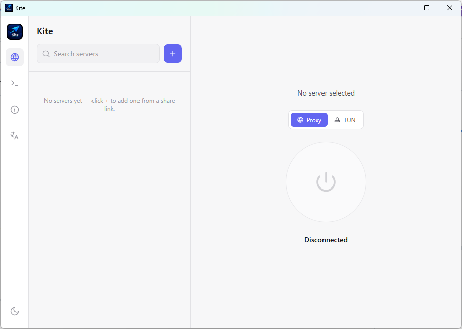
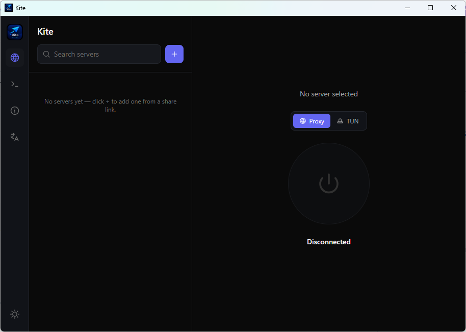

<div align="center">
  

  # Kite

  **Un client de bureau multiplateforme pour V2Ray / proxy.**
  Backend Wails + Go, frontend React/Tailwind, xray-core/sing-box embarqués sous forme de bibliothèques Go.

  [](https://github.com/freeb5d/kite/releases/latest)
  [](https://github.com/freeb5d/kite/actions/workflows/release.yml)
  [](#téléchargements)
  [](https://goreportcard.com/report/github.com/freeb5d/kite)
  [](LICENSE)

  [Télécharger](#téléchargements) · [Fonctionnalités](#fonctionnalités) · [Compilation depuis les sources](#compilation-depuis-les-sources) · [Architecture](#architecture)

  [English](README.md) · [中文](README.zh.md) · [فارسی](README.fa.md) · [Türkçe](README.tr.md) · [العربية](README.ar.md) · Français · [Deutsch](README.de.md) · [Русский](README.ru.md)
</div>

<p align="center">
  
  
</p>

---

## Téléchargements

Récupérez la dernière version depuis la **[page des Releases](https://github.com/freeb5d/kite/releases/latest)** :

| Plateforme | Téléchargement |
| --- | --- |
| Windows (x64) | `kite-windows-amd64.exe` |
| Linux (x64) | `kite-linux-amd64` |
| macOS (Apple Silicon) | `kite-macos-arm64` |

Chaque plateforme est livrée sous forme d'un seul exécutable portable — pas d'installateur, pas de droits administrateur requis (la version macOS est le binaire brut extrait du bundle `.app` produit par Wails ; voir [Limitations connues](#limitations-connues--prochaines-étapes) pour l'avertissement Gatekeeper que cela implique et comment le contourner). Une fois installé, il vérifie les nouvelles versions au démarrage et peut se mettre à jour en un clic.

## Fonctionnalités

- **Formats de lien** : `vmess://`, `vless://`, `trojan://`, `ss://` — collez un lien de partage et il est analysé et enregistré
- **URL d'abonnement** — collez un lien d'abonnement `http(s)://` (le format de liste de liens en base64 utilisé par V2RayN/V2RayNG/Shadowrocket) et tous les serveurs qu'il contient sont importés d'un coup, regroupés dans un groupe repliable unique de la liste (un abonnement peut contenir des centaines de serveurs). Le groupe affiche les infos de forfait/trafic/expiration lorsque le fournisseur les communique (via l'en-tête `Subscription-Userinfo`, ou les fausses entrées « info » que certains fournisseurs mélangent dans la liste de liens), et possède son propre bouton de synchronisation pour récupérer et actualiser ses serveurs
- **Deux moteurs au choix**, tous deux embarqués comme bibliothèques Go (et non des binaires externes) — contrôle complet du cycle de vie, sans avoir à analyser la sortie standard pour les statistiques. **xray-core** est le moteur par défaut (prise en charge de transports plus large, notamment `tcp` avec déguisement `headerType=http`) ; **sing-box** est le seul à proposer le mode TUN. Changez à tout moment depuis le panneau « À propos » (déconnectez-vous d'abord)
- **Transports** : TCP (y compris le déguisement `headerType=http` de xray-core), WebSocket et gRPC, avec détection de sécurité TLS/REALITY directement depuis le lien
- **Intégration au proxy système** — Connexion/Déconnexion bascule automatiquement le proxy HTTP du système d'exploitation (registre par utilisateur sous Windows, sans élévation nécessaire)
- **Mode TUN (Windows, sing-box uniquement)** — achemine tout le trafic système via un adaptateur réseau virtuel (WinTun, inclus), plutôt que seulement les applications qui respectent un paramètre de proxy. Nécessite les droits administrateur et le moteur sing-box sélectionné ; Kite peut se relancer lui-même en mode élevé en un clic
- **Kill switch (Windows)** — bloque tout le trafic sortant sauf celui de Kite lui-même pendant la connexion, via une paire de règles de pare-feu Windows, afin qu'une application ignorant le proxy système (ou un processus moteur planté) ne puisse pas faire fuiter de trafic hors du tunnel. Même exigence de droits administrateur que le mode TUN
- **Icône dans la barre système** — fermer la fenêtre la cache dans la barre système au lieu de quitter, afin qu'une connexion active continue de fonctionner ; le menu contient Afficher Kite, Se déconnecter et Quitter Kite
- **Diagnostics intégrés** — le bouton Test effectue une vraie requête à travers le tunnel et rapporte le résultat réel ; un visualiseur de journal affiche en ligne le journal de débogage du moteur actif
- **Mise à jour automatique** — vérifie les GitHub Releases au lancement, télécharge, remplace et relance en un clic (le panneau « À propos » affiche la version de Kite, le moteur actif et sa version)
- **Thèmes sombre / clair**, avec une liste de serveurs consultable, un renommage en ligne et une suppression en un clic
- **8 langues**, modifiables depuis la barre latérale (le persan utilise la police Vazirmatn intégrée) :
  - 🇬🇧 English (par défaut)
  - 🇨🇳 中文 (chinois)
  - 🇮🇷 فارسی (persan)
  - 🇹🇷 Türkçe (turc)
  - 🇸🇦 العربية (arabe)
  - 🇫🇷 Français
  - 🇩🇪 Deutsch (allemand)
  - 🇷🇺 Русский (russe)

## Compilation depuis les sources

### Installation ponctuelle de la chaîne d'outils

1. **Go 1.27+** — https://go.dev/dl/ . Windows nécessite aussi un compilateur C pour CGO (utilisé par Wails et certaines de ses dépendances) — installez [TDM-GCC](https://jmeubank.github.io/tdm-gcc/) ou `winget install -e --id GoLang.Go` ainsi que `mingw-w64-x86_64-gcc` de MSYS2.
2. **Node.js (LTS)** — https://nodejs.org , ou `winget install OpenJS.NodeJS.LTS`.
3. **CLI Wails** :
   ```bash
   go install github.com/wailsapp/wails/v2/cmd/wails@latest
   wails doctor
   ```

### Lancer l'application

```bash
go mod tidy
cd frontend && npm install && cd ..
wails dev
```

### Compiler un binaire de release

```bash
wails build -tags webkit2_41
```

## Architecture

```
kite/
├── main.go / app.go        Wails entrypoint + the App struct (Go methods
│                            exposed to the frontend via the JS bridge)
├── internal/
│   ├── xray/                 Engine facade (package/dir keeps the historical
│   │   │                      name from when it *was* the xray-core wrapper
│   │   │                      -- see CHANGELOG). Dispatches Start/Stop/
│   │   │                      Status/Traffic to whichever concrete engine
│   │   │                      below is currently selected (settings.json),
│   │   │                      so app.go doesn't know which one is active.
│   │   └── facade.go
│   ├── engine/
│   │   ├── xraycore/          xray-core lifecycle (the default engine) --
│   │   │                      manager.go builds a core.Instance via
│   │   │                      serial.LoadJSONConfig + core.New; config.go
│   │   │                      builds the JSON from a server profile
│   │   └── singbox/           sing-box lifecycle (the only engine with TUN
│   │       ├── manager.go     support) -- Start/Stop/Restart a real box.Box
│   │       ├── config.go      Server profile -> sing-box JSON config,
│   │       │                  decoded via sing-box's own registry-aware
│   │       │                  JSON decoder (see include.Context)
│   │       ├── stats.go       Traffic counters (stub, see below)
│   │       └── tun_windows.go Writes the embedded wintun.dll next to the
│   │                          exe (TUN mode needs it alongside the binary)
│   ├── profile/              vmess/vless/trojan/ss link parsing +
│   │                         JSON-file server storage
│   ├── system/                per-OS HTTP/SOCKS system proxy toggling +
│   │   │                      TUN-mode support (Windows)
│   │   ├── proxy_windows.go   HKCU Internet Settings (no admin needed)
│   │   ├── proxy_darwin.go    networksetup
│   │   ├── proxy_linux.go     gsettings (GNOME)
│   │   ├── elevate_windows.go Check/request administrator privileges
│   │   ├── route_windows.go   Exception route so xray's own upstream
│   │   │                      connection doesn't loop through the TUN
│   │   │                      adapter it's feeding (see that file's docs)
│   │   └── wintun/            Embedded Wintun driver DLL (dual GPLv2/MIT,
│   │                          see WINTUN_LICENSE.txt in that directory)
│   └── update/                self-update: check GitHub Releases, download
│                               + swap the running executable, relaunch
├── frontend/                 Vite + React + Tailwind (CSS-variable theming
│                              for dark/light), talks to app.go via Wails
└── .github/workflows/         CI: builds + publishes GitHub Releases on
    release.yml                 any pushed `v*` tag
```

Chaque méthode Go liée sur `App` (dans [app.go](app.go)) devient une fonction JS appelable depuis le frontend dès que `wails dev`/`wails build` génère `frontend/wailsjs/go/main/App.js`.

## Limitations connues / prochaines étapes

- **Le mode TUN ne fonctionne qu'avec le moteur sing-box** — xray-core (par défaut) n'a pas d'entrée TUN ici ; basculer en mode TUN alors que xray-core est sélectionné échoue avec une erreur claire vous invitant à changer de moteur d'abord dans le panneau « À propos ».
- **Les statistiques de trafic en direct sont factices sur les deux moteurs** — les chiffres du panneau « Afficher plus » affichent toujours 0B/s. Le stats.Manager de xray-core et le `trafficcontrol.Manager` de sing-box (via `experimental.clash_api`/`v2ray_api`) nécessitent tous deux un câblage supplémentaire qui n'a pas encore été fait — une prochaine étape pour les deux moteurs.
- **macOS uniquement Apple Silicon (arm64)** — pas de build Intel. Si nécessaire, ajoutez une entrée de matrice `darwin/amd64` à côté de `darwin/arm64` dans `.github/workflows/release.yml`.
- **Le mode TUN est réservé à Windows** et à IPv4 pour l'instant — la route d'exception qui empêche la propre connexion amont du moteur de boucler à travers l'adaptateur TUN (`internal/system/route_windows.go`) ne couvre que les adresses IPv4 résolues ; un serveur accessible uniquement via IPv6 ne fonctionnera pas encore en mode TUN. Le support TUN pour Linux/macOS est possible (le propre paquet `tun` de sing-box prend déjà en charge les deux) mais n'est pas encore câblé ici.
- **Le proxy système Linux ne couvre que GNOME** (`gsettings`) — les autres environnements de bureau nécessitent leur propre backend dans `internal/system/proxy_linux.go`.
- **Le kill switch est réservé à Windows** — implémenté via des règles `netsh advfirewall` (`internal/system/killswitch_windows.go`) ; Linux/macOS ont besoin de leur propre backend (`iptables`/`pfctl`) et ne sont pas encore implémentés (le bouton est masqué sur ces plateformes, comme pour le mode TUN).
- **Le bouton de réduction natif ne fait toujours que réduire dans la barre des tâches** — Wails v2 n'expose pas de hook pour l'événement de réduction au niveau du système d'exploitation, seulement la fermeture de fenêtre (`OnBeforeClose`, utilisé par la fonctionnalité de barre système). Seule la fermeture de la fenêtre la cache dans la barre système.
- **Pas encore de tests automatisés.**
- **Pas de signature de code** — Windows SmartScreen et macOS Gatekeeper avertiront tous deux pour un binaire non signé ; c'est normal pour l'instant. Sur macOS, exécuter le binaire téléchargé pour la première fois nécessite `xattr -d com.apple.quarantine kite-macos-arm64` (ou clic droit → Ouvrir) pour contourner Gatekeeper, puisqu'il n'est pas notarié. Sur Windows, les antivirus (Defender compris) mettent parfois en quarantaine `wintun.dll` juste après que Kite l'écrit à côté de lui-même pour le mode TUN, car une DLL réseau proche du noyau comme celle-ci est souvent signalée de manière heuristique — le même problème que rencontrent WireGuard, v2rayN et d'autres applications basées sur Wintun. Si le mode TUN échoue avec une erreur du type fichier introuvable, ajoutez le dossier de Kite aux exclusions de votre antivirus.

## Contribuer

Les issues et PR sont les bienvenues. Voir [Limitations connues](#limitations-connues--prochaines-étapes) ci-dessus pour ce qu'il reste réellement à faire.

## Licence

[MIT](LICENSE)
