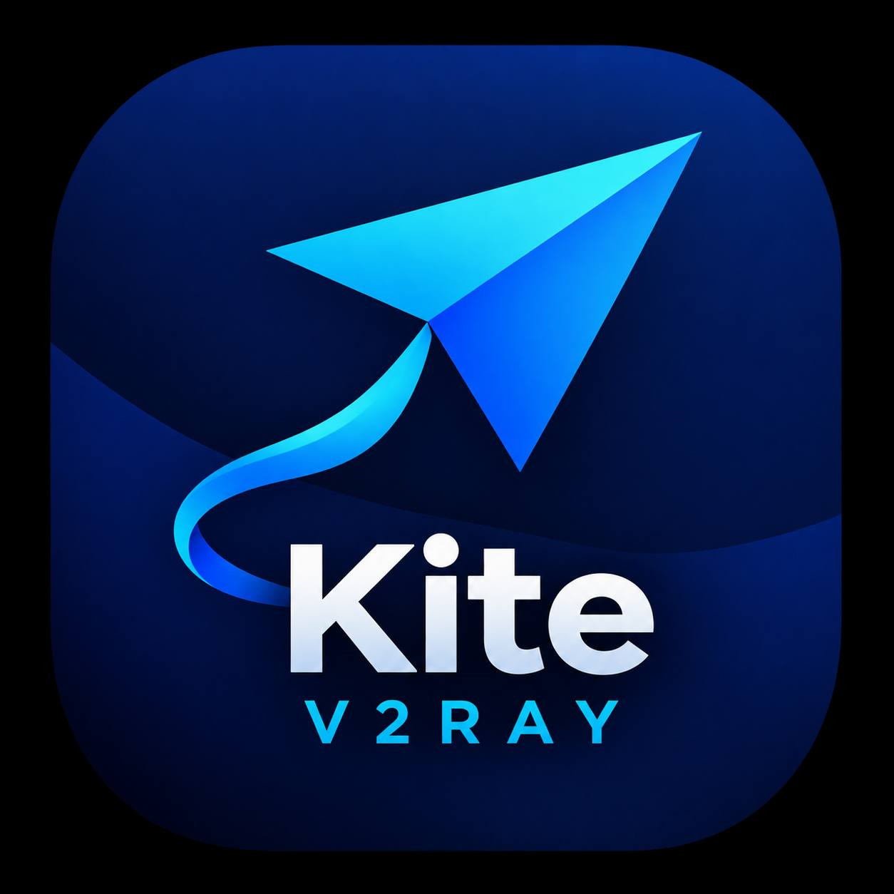

<div align="center">
  

  # Kite

  **A cross-platform desktop V2Ray/Xray client.**
  Wails + Go backend, React/Tailwind frontend, xray-core embedded as a Go library.

  [](https://github.com/freeb5d/kite/releases/latest)
  [](https://github.com/freeb5d/kite/actions/workflows/release.yml)
  [](#downloads)
  [](https://goreportcard.com/report/github.com/freeb5d/kite)
  [](LICENSE)

  [Download](#downloads) · [Features](#features) · [Building from source](#building-from-source) · [Architecture](#architecture)
</div>

---

## Downloads

Grab the latest build from the **[Releases page](https://github.com/freeb5d/kite/releases/latest)**:

| Platform | Download |
| --- | --- |
| Windows (x64) | `kite-windows-amd64.exe` |
| Linux (x64) | `kite-linux-amd64` |
| macOS | not currently built (see [Known gaps](#known-gaps--next-steps)) |

Kite ships as a single portable executable — no installer, no admin rights required.
Once installed, it checks for new releases on startup and can update itself in one click.

## Features

- **Link formats**: `vmess://`, `vless://`, `trojan://`, `ss://` — paste a share link and it's parsed and saved
- **Real xray-core**, embedded as a Go library (not a shelled-out binary) — full lifecycle control, no parsing stdout for stats
- **Transports**: TCP and WebSocket, with TLS/REALITY security detection straight from the link
- **System proxy integration** — Connect/Disconnect toggles the OS HTTP proxy automatically (per-user registry on Windows, no elevation needed)
- **TUN mode (Windows)** — routes all system traffic through a virtual network adapter (WinTun, bundled), instead of just apps that honor a proxy setting. Needs administrator privileges; Kite can relaunch itself elevated with one click
- **Built-in diagnostics** — a Test button makes a real request through the tunnel and reports the actual result; a log viewer surfaces xray-core's own debug log inline
- **Self-updating** — checks GitHub Releases on launch, one click downloads, swaps, and relaunches
- **Dark / light themes**, with a searchable server list, inline rename, and one-click remove
- **7 languages** — English (default), 中文, فارسی, Türkçe, العربية, Français, Deutsch, switchable from the sidebar (Persian uses the bundled Vazirmatn font)

## Building from source

### One-time toolchain setup

1. **Go 1.27+** — https://go.dev/dl/. Windows also needs a C compiler for CGO
   (xray-core and some Wails dependencies use it) — install
   [TDM-GCC](https://jmeubank.github.io/tdm-gcc/) or `winget install -e --id GoLang.Go`
   plus MSYS2's `mingw-w64-x86_64-gcc`.
2. **Node.js (LTS)** — https://nodejs.org, or `winget install OpenJS.NodeJS.LTS`.
3. **Wails CLI**:
   ```bash
   go install github.com/wailsapp/wails/v2/cmd/wails@latest
   wails doctor   # confirms platform dependencies (WebView2 etc.) are present
   ```

### Run it

```bash
go mod tidy                     # resolves dependencies into go.sum
cd frontend && npm install && cd ..
wails dev                       # generates frontend/wailsjs/*, hot-reloading dev build
```

### Build a release binary

```bash
wails build -tags webkit2_41    # Linux only needs the webkit2_41 tag; omit on Windows
```

## Architecture

```
kite/
├── main.go / app.go        Wails entrypoint + the App struct (Go methods
│                            exposed to the frontend via the JS bridge)
├── internal/
│   ├── xray/                xray-core lifecycle
│   │   ├── manager.go        Start/Stop/Restart a real core.Instance
│   │   ├── config.go         Server profile -> Xray JSON config ->
│   │   │                     conf.Config.Build() -> *core.Config
│   │   ├── stats.go          Traffic counters (stub, see below)
│   │   └── tun_windows.go    Writes the embedded wintun.dll next to the
│   │                         exe (TUN mode needs it alongside the binary)
│   ├── profile/              vmess/vless/trojan/ss link parsing +
│   │                         JSON-file server storage
│   ├── system/                per-OS HTTP/SOCKS system proxy toggling +
│   │   │                      TUN-mode support (Windows)
│   │   ├── proxy_windows.go   HKCU Internet Settings (no admin needed)
│   │   ├── proxy_darwin.go    networksetup
│   │   ├── proxy_linux.go     gsettings (GNOME)
│   │   ├── elevate_windows.go Check/request administrator privileges
│   │   ├── route_windows.go   Exception route so xray's own upstream
│   │   │                      connection doesn't loop through the TUN
│   │   │                      adapter it's feeding (see that file's docs)
│   │   └── wintun/            Embedded Wintun driver DLL (dual GPLv2/MIT,
│   │                          see WINTUN_LICENSE.txt in that directory)
│   └── update/                self-update: check GitHub Releases, download
│                               + swap the running executable, relaunch
├── frontend/                 Vite + React + Tailwind (CSS-variable theming
│                              for dark/light), talks to app.go via Wails
└── .github/workflows/         CI: builds + publishes GitHub Releases on
    release.yml                 any pushed `v*` tag
```

Every bound Go method on `App` (in [app.go](app.go)) becomes a callable JS function in
the frontend once `wails dev`/`wails build` generates `frontend/wailsjs/go/main/App.js`.

## Known gaps / next steps

- **macOS builds are currently disabled** in CI — the `macos-13` GitHub runner pool had
  very long queue times when this was set up. Re-enabling it just means restoring the
  matrix entry in `.github/workflows/release.yml` (see git history on that file for the
  exact config, including a `webkit2_41`-style workaround needed for a newer-toolchain
  bindings-generator crash on `macos-latest`).
- **Traffic stats are a stub** — `internal/xray/stats.go`'s `Traffic()` always returns
  zero; it needs to read from the running instance's stats manager instead.
- **TUN mode is Windows-only** and IPv4-only for now — the exception route that keeps
  xray's own upstream connection from looping through the TUN adapter
  (`internal/system/route_windows.go`) only covers resolved IPv4 addresses; a server
  that's only reachable over IPv6 won't work in TUN mode yet. Linux/macOS TUN support is
  possible (xray-core's own `proxy/tun` package already supports both) but isn't wired
  up here.
- **Linux system proxy only covers GNOME** (`gsettings`) — other desktop environments
  need their own backend in `internal/system/proxy_linux.go`.
- **No automated tests yet.**
- **No code-signing** — Windows SmartScreen and macOS Gatekeeper will both warn on an
  unsigned binary; this is expected for now.

## Contributing

Issues and PRs welcome. See [Known gaps](#known-gaps--next-steps) above for what's
actually left to do.

## License

[MIT](LICENSE)
